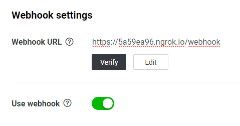

# Laravel Line Bot

[![Latest Version on Packagist][ico-version]][link-packagist]
[![Software License][ico-license]](LICENSE.md)
[![CI Build Status][ico-ci]][link-ci]
[![Style CI Build Status][ico-style-ci]][link-style-ci]
[![Codecov Status][ico-codecov]][link-codecov]
[![Total Downloads][ico-downloads]][link-downloads]

> 開發中

在 Laravel 中開發 Line Bot

## 安裝前準備

* 建立一個 Laravel 專案
* 準備一個 HTTPS 的網址，開發時建議使用 [ngrok](https://ngrok.com/) 來建立臨時網址。

## 安裝

使用 Composer 安裝：

```bash
composer require ycs77/laravel-line-bot
```

發布設定檔案 (選用)：

```bash
php artisan vendor:publish --provider=Ycs77\\LaravelLineBot\\LineBotServiceProvider
```

設定 Line Bot 金鑰到 `.env` 檔裡 (在 [Line Developers](https://developers.line.biz/zh-hant/) 申請)：

```
LINE_BOT_CHANNEL_ACCESS_TOKEN=xxx...
LINE_BOT_CHANNEL_SECRET=123...
```

執行安裝指令，產生 Laravel LineBot 所需的檔案：

```bash
php artisan linebot:install
```

增加 webhook 路徑到 Laravel 的 `VerifyCsrfToken` Middleware 中的 `except` 陣列，以禁用 CSRF 檢查：

*app/Http/Middleware/VerifyCsrfToken.php*
```php
class VerifyCsrfToken extends Middleware
{
    protected $except = [
        'webhook',
    ];
}
```

最後，在 [Line Developers](https://developers.line.biz/zh-hant/) 設定 webhook 網址：



## 使用

首先先開啟 `routes/linebot.php`，在 Laravel LineBot 中所有的監聽訊息及回傳的程式，都是在這個檔案中：

*routes/linebot.php*
```php
<?php

use Ycs77\LaravelLineBot\Facades\LineBot;

LineBot::on()->text('嗨', function () {
    LineBot::text('你好')->reply();
});

LineBot::on()->fallback(function () {
    LineBot::text('我不大了解您的意思...')->reply();
});

```

在這個範例中，如果用戶傳送 `嗨` 時，會自動回應 `你好`。

### 監聽事件 (Event)

最基本的事件是監聽文字訊息事件，當然也可以使用 `{name}` 的替代文字來擷取用戶傳送的部分文字，並轉換成變數：

> 用法參考自 Laravel Route

```php
LineBot::on()->text('我叫{name}', function ($name) {
    LineBot::text("你好{$name}")->reply();
});
```

若沒有匹配成功任何訊息，將會回覆預設回應：

```php
LineBot::on()->fallback(function () {
    LineBot::text('我不大了解您的意思...')->reply();
});
```

除了文字訊息事件，也可以監聽圖片訊息事件、跟隨事件等：

```php
LineBot::on()->image(function () {
    LineBot::text('圖片')->reply();
});

LineBot::on()->follow(function () {
    LineBot::text('加為好友')->reply();
});
```

全部可以監聽的事件：

* Text Message Event (文字訊息事件)
* (未完成) Image Message Event (圖片訊息事件)
* (未完成) Video Message Event (影片訊息事件)
* (未完成) Audio Message Event (音檔訊息事件)
* (未完成) File Message Event (檔案訊息事件)
* (未完成) Location Message Event (位置訊息事件)
* (未完成) Sticker Message Event (貼圖訊息事件)
* (未完成) Follow Event (加為好友事件)
* (未完成) Unfollow Event (取消好友事件)
* (未完成) Join Event (LineBot 加入聊天室事件)
* (未完成) Leave Event (LineBot 退出聊天室事件)
* (未完成) Member Join Event (其他人加入聊天室事件)
* (未完成) Member Leave Event (其他人退出聊天室事件)
* (未完成) Postback Event (Postback 事件)
* (未完成) Account Link Event (用戶連結事件)
* Fallback Event (預設回應)

### 回應 (Reply)

文字訊息：

```php
LineBot::on()->text('嗨', function () {
    LineBot::text('你好')->reply();
});
```

按鈕選單：

> 行動按鈕使用方式請參考 [行動按鈕](#%e8%a1%8c%e5%8b%95%e6%8c%89%e9%88%95-action)

```php
use Ycs77\LaravelLineBot\ActionBuilder;
use Ycs77\LaravelLineBot\Message\TemplateBuilder;

LineBot::on()->text('選單', function () {
    LineBot::template('這是我的選單', function (TemplateBuilder $template) {
        $template->button('選單', '請選擇', 'https://example.test/image/path...', function (ActionBuilder $action) {
            $action->message('購買');
            $action->message('加到購物車');
            $action->url('瀏覽網站', 'https://developers.line.biz/zh-hant/');
        });
    })->reply();
});

LineBot::on()->text('購買', function () {
    LineBot::text('購買成功！')->reply();
});

LineBot::on()->text('加到購物車', function () {
    LineBot::text('加到購物車成功！')->reply();
});
```

全部可以使用的回覆訊息類型：

* Text (文字)
* (未完成) Sticker (貼圖)
* (未完成) Image (圖片)
* (未完成) Video (影片)
* (未完成) Audio (音檔)
* (未完成) Location (位置)
* (未完成) Imagemap (圖片映射訊息)
* Template Buttons (按鈕選單)
* Template Confirm (確認)
* (未完成) Template Carousel (輪播)
* (未完成) Template Image carousel (圖片輪播)
* (未完成) Flex

### 快速回覆 (Quick Reply)

> 行動按鈕使用方式請參考 [行動按鈕](#%e8%a1%8c%e5%8b%95%e6%8c%89%e9%88%95-action)

> 快速回覆無法使用 Url 行動

```php
use Ycs77\LaravelLineBot\QuickReplyBuilder;

LineBot::on()->text('哈囉', function () {
    LineBot::text('請問有什麼能為您服務?')
        ->quickReply(function (QuickReplyBuilder $action) {
            $action->message('商品清單');
            $action->message('聯絡資訊');
        })
        ->reply();
});

LineBot::on()->text('商品清單', function () {
    LineBot::text('商品清單...')->reply();
});

LineBot::on()->text('聯絡資訊', function () {
    LineBot::text('聯絡資訊...')->reply();
});
```

### 行動按鈕 (Action)

行動按鈕需搭配 Quick Reply 和 Template 訊息使用。以下為使用範例：

```php
$action->message('購買');
$action->message('加到購物車');
$action->url('瀏覽網站', 'https://example.test/');
```

全部可以使用的行動按鈕：

* Message (文字訊息)
* Url (網址)
* Postback
* Location (選擇位置)
* Datetime Picker (日期)
* Camera (相機)
* Camera Roll (圖片庫)

### Rich Menu

#### 新增 Rich Menu 和上傳圖片

> 詳細配置請參考 [Line 官方說明：Using rich menus](https://developers.line.biz/en/docs/messaging-api/using-rich-menus/)

先在 `config/linebot.php` 中設定好 `rich_menu`，和準備一張圖片，執行 `linebot:richmenu:create` 命令以新增 Rich Menu：

> 範例中圖片路徑為 `"public/image.jpg"`，可以修改成實際圖片的路徑。

```
php artisan linebot:richmenu:create "public/image.jpg"
```

#### 查看 Rich Menu

查看全部 Rich Menu ID：

```
php artisan linebot:richmenu:list
```

查看全部 Rich Menu 的原始資料：

```
php artisan linebot:richmenu:list --raw
```

#### 刪除 Rich Menu

刪除指定 Rich Menu ID：

```
php artisan linebot:richmenu:clear richmenuid-sdg24sd56gf...
```

刪除全部 Rich Menu：

```
php artisan linebot:richmenu:clear --all
```

更多資訊請參考 Line 官方文檔：

* [Line SDK 文檔](https://developers.line.biz/en/reference/messaging-api/)
* [Line 官方 SDK - PHP](https://github.com/line/line-bot-sdk-php)

## 測試

運行測試：

```
composer test
```

運行指令產生測試覆蓋率報告，報告產生在 `build/coverage-report`：

```
composer coverage
```

[ico-version]: https://img.shields.io/packagist/v/ycs77/laravel-line-bot?style=flat-square
[ico-license]: https://img.shields.io/badge/license-MIT-brightgreen?style=flat-square
[ico-ci]: https://img.shields.io/travis/ycs77/laravel-line-bot?style=flat-square
[ico-style-ci]: https://github.styleci.io/repos/217076147/shield?style=flat-square
[ico-codecov]: https://img.shields.io/codecov/c/github/ycs77/laravel-line-bot?style=flat-square
[ico-downloads]: https://img.shields.io/packagist/dt/ycs77/laravel-line-bot?style=flat-square

[link-packagist]: https://packagist.org/packages/ycs77/laravel-line-bot
[link-ci]: https://travis-ci.org/ycs77/laravel-line-bot
[link-style-ci]: https://github.styleci.io/repos/217076147
[link-codecov]: https://codecov.io/gh/ycs77/laravel-line-bot
[link-downloads]: https://packagist.org/packages/ycs77/laravel-line-bot
