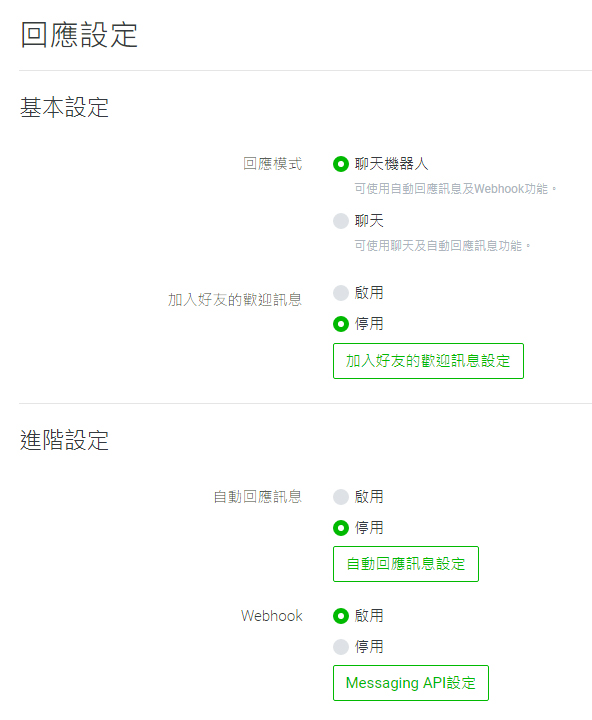

# Laravel Line Bot

[![Latest Version on Packagist][ico-version]][link-packagist]
[![Software License][ico-license]](LICENSE.md)
[![CI Build Status][ico-ci]][link-ci]
[![Style CI Build Status][ico-style-ci]][link-style-ci]
[![Codecov Status][ico-codecov]][link-codecov]
[![Total Downloads][ico-downloads]][link-downloads]

> 開發中

在 Laravel 中快速開發 Line Bot

## 安裝前準備

* 建立一個 Laravel (或 Lumen) 專案
* 在 [Line Developers](https://developers.line.biz/console/) 設定新的 Messaging API
* 準備一個 HTTPS 的網址，開發時建議使用 [ngrok](https://ngrok.com/) 來建立臨時網址。

## 安裝

使用 Composer 安裝：

```bash
composer require ycs77/laravel-line-bot
```

發布設定檔案 (選用)：

```bash
php artisan vendor:publish --provider=Ycs77\\LaravelLineBot\\LineBotServiceProvider
```

設定 Line Bot 金鑰到 `.env` 檔裡 (在剛才新增的 Messaging API 裡產生)：

```
LINE_BOT_CHANNEL_ACCESS_TOKEN=xxx...
LINE_BOT_CHANNEL_SECRET=123...
```

執行安裝指令，產生 Laravel LineBot 所需的檔案：

```bash
php artisan linebot:install
```

增加 webhook 路徑到 Laravel 的 `VerifyCsrfToken` Middleware 中的 `except` 陣列，以禁用 CSRF 檢查：

*app/Http/Middleware/VerifyCsrfToken.php*
```php
class VerifyCsrfToken extends Middleware
{
    protected $except = [
        'webhook',
    ];
}
```

最後，開啟 [Line Developers](https://developers.line.biz/console/)，關閉「歡迎訊息」和「自動回應訊息」，並開啟和設定 Webhook 網址：



### Lumen

如果使用 Lumen，就需要別的方式來註冊。使用 Composer 安裝完套件後，首先先把 config 檔案複製到 `config/linebot.php` (若 config 資料夾不存在請自行創建)，然後開啟 `bootstrap/app.php`，新增下方程式碼來註冊。

*bootstrap/app.php*
```php
$app->configure('app');
$app->configure('linebot');

/*
|--------------------------------------------------------------------------
| Register Service Providers
|--------------------------------------------------------------------------
|
| ...
|
*/

$app->register(Ycs77\LaravelLineBot\LineBotLumenServiceProvider::class);
```

最後，執行 `php artisan linebot:install` 和在 [Line Developers](https://developers.line.biz/zh-hant/) 設定 webhook 網址即可。

## 使用

首先先開啟 `routes/linebot.php`，在 Laravel LineBot 中所有的監聽訊息及回傳訊息的程式，都是在這個檔案中：

*routes/linebot.php*
```php
<?php

use Ycs77\LaravelLineBot\Facades\LineBot;

LineBot::on()->text('嗨', function () {
    LineBot::text('你好')->reply();
});

LineBot::on()->fallback(function () {
    LineBot::text('我不大了解您的意思...')->reply();
});

```

在這個範例中，如果用戶傳送 `嗨` 時，會自動回應 `你好`。

### 監聽事件 (Event)

最基本的事件是監聽文字訊息事件，當然也可以使用 `{name}` 的替代文字來擷取用戶傳送的部分文字，並轉換成變數：

> 用法參考自 Botman

```php
LineBot::on()->text('我叫{name}', function ($name) {
    LineBot::text("你好{$name}")->reply();
});
```

若沒有匹配成功任何訊息，將會回覆預設回應：

```php
LineBot::on()->fallback(function () {
    LineBot::text('我不大了解您的意思...')->reply();
});
```

除了文字訊息事件，也可以監聽圖片訊息事件、跟隨事件等：

> 這些功能目前尚未完成

```php
LineBot::on()->image(function () {
    LineBot::text('圖片')->reply();
});

LineBot::on()->follow(function () {
    LineBot::text('加為好友')->reply();
});
```

全部可以監聽的事件：

* `text()`: Text Message Event (文字訊息事件)
* `image()`: ***(未完成)*** Image Message Event (圖片訊息事件)
* `video()`: ***(未完成)*** Video Message Event (影片訊息事件)
* `audio()`: ***(未完成)*** Audio Message Event (音檔訊息事件)
* `file()`: ***(未完成)*** File Message Event (檔案訊息事件)
* `location()`: ***(未完成)*** Location Message Event (位置訊息事件)
* `sticker()`: ***(未完成)*** Sticker Message Event (貼圖訊息事件)
* `follow()`: ***(未完成)*** Follow Event (加為好友事件)
* `unfollow()`: ***(未完成)*** Unfollow Event (取消好友事件)
* `join()`: ***(未完成)*** Join Event (LineBot 加入聊天室事件)
* `leave()`: ***(未完成)*** Leave Event (LineBot 退出聊天室事件)
* `memberJoin()`: ***(未完成)*** Member Join Event (其他人加入聊天室事件)
* `memberLeave()`: ***(未完成)*** Member Leave Event (其他人退出聊天室事件)
* `postback()`: ***(未完成)*** Postback Event (Postback 事件)
* `accountLink()`: ***(未完成)*** Account Link Event (用戶連結事件)
* `fallback()`: Fallback Event (預設回應)

### 回應 (Reply)

文字訊息：

```php
LineBot::on()->text('嗨', function () {
    LineBot::text('你好')->reply();
});
```

按鈕選單：

> 行動按鈕使用方式請參考 [行動按鈕 (Action)](#%e8%a1%8c%e5%8b%95%e6%8c%89%e9%88%95-action)

```php
use Ycs77\LaravelLineBot\ActionBuilder;
use Ycs77\LaravelLineBot\Message\TemplateBuilder;

LineBot::on()->text('選單', function () {
    LineBot::template('這是我的選單', function (TemplateBuilder $template) {
        $template->button('選單', '請選擇', 'https://example.test/image/path...', function (ActionBuilder $action) {
            $action->message('購買');
            $action->message('加到購物車');
            $action->url('瀏覽網站', 'https://developers.line.biz/zh-hant/');
        });
    })->reply();
});

LineBot::on()->text('購買', function () {
    LineBot::text('購買成功！')->reply();
});

LineBot::on()->text('加到購物車', function () {
    LineBot::text('加到購物車成功！')->reply();
});
```

全部可以使用的回覆訊息類型：

* `text()`: Text (文字)
* `sticker()`: ***(未完成)*** Sticker (貼圖)
* `image()`: ***(未完成)*** Image (圖片)
* `video()`: ***(未完成)*** Video (影片)
* `audio()`: ***(未完成)*** Audio (音檔)
* `location()`: ***(未完成)*** Location (位置)
* `imagemap()`: ***(未完成)*** Imagemap (圖片映射)
* `template()`: Template (模板訊息)
* `flex()`: ***(未完成)*** Flex

全部可以使用的模板訊息類型：

* `buttons()`: Template Buttons (按鈕選單)
* `confirm()`: Template Confirm (確認)
* `carousel()`: ***(未完成)*** Template Carousel (輪播)
* `imageCarousel()`: ***(未完成)*** Template Image carousel (圖片輪播)

### 快速回覆 (Quick Reply)

> 行動按鈕使用方式請參考 [行動按鈕 (Action)](#%e8%a1%8c%e5%8b%95%e6%8c%89%e9%88%95-action)

> 快速回覆無法使用 Url Action

```php
use Ycs77\LaravelLineBot\QuickReplyBuilder;

LineBot::on()->text('哈囉', function () {
    LineBot::text('請問有什麼能為您服務?')
        ->quickReply(function (QuickReplyBuilder $action) {
            $action->message('商品清單');
            $action->message('聯絡資訊');
        })
        ->reply();
});

LineBot::on()->text('商品清單', function () {
    LineBot::text('商品清單...')->reply();
});

LineBot::on()->text('聯絡資訊', function () {
    LineBot::text('聯絡資訊...')->reply();
});
```

### 行動按鈕 (Action)

行動按鈕需搭配 Quick Reply 和 Template 訊息使用。以下為使用範例：

```php
$action->message('購買');
$action->message('加到購物車');
$action->url('瀏覽網站', 'https://example.test/');
```

全部可以使用的行動按鈕：

* `message()`: Message (文字訊息)
* `url()`: Url (網址)
* `postback()`: Postback
* `location()`: Location (選擇位置)
* `datetimePicker()`: Datetime Picker (日期)
* `camera()`: Camera (相機)
* `cameraRoll()`: Camera Roll (圖片庫)

## 用戶資訊

### 取得 Line 用戶資料

使用 `LineBot::profile()` 即可取得當前用戶的資訊：

```php
LineBot::on()->text('profile', function () {
    $profile = LineBot::profile();
    LineBot::text("你好 {$profile->name()}")->reply();
});
```

可以取得的用戶資訊：

* `id()`: User ID
* `name()`: 用戶顯示名稱 (暱稱)
* `picture()`: 用戶大頭貼網址
* `status()`: 用戶狀態消息文字

### 整合 Eloquent

這個功能預設是關閉的，需要先把 LineBot 設置中的 `user.enabled` 改成 `true`，才可以開始使用 Eloquent：

> 還可以依需求調整 `model` (用戶模型) 及 `id` (辨識用戶的欄位名稱)。

*config/linebot.php*
```php
'user' => [
    'enabled' => true,
    'model' => App\User::class,
    'id' => 'line_user_id',
],
```

> 在 Lumen 中需要開啟 `bootstrap/app.php` 取消 `$app->withEloquent();` 的註釋

然後將 `users` 資料表修改成以下欄位，和運行 `php artisan migrate`：

*database/migrations/2014_10_12_000000_create_users_table.php*
```php
Schema::create('users', function (Blueprint $table) {
    $table->increments('id');
    $table->string('name');
    $table->string('line_user_id')->unique();
    $table->timestamps();
});
```

修改 User Model：

*app/User.php*
```php
<?php

namespace App;

use Illuminate\Foundation\Auth\User as Authenticatable;
use Illuminate\Notifications\Notifiable;
use Ycs77\LaravelLineBot\CanStoreLineBotUser;
use Ycs77\LaravelLineBot\Contracts\User as UserContract;

class User extends Authenticatable implements UserContract
{
    use Notifiable, CanStoreLineBotUser;

    protected $fillable = [
        'name', 'line_user_id',
    ];
}

```

最後，就可以使用 `LineBot::user()` 來取得用戶模型了：

```php
LineBot::on()->text('user', function () {
    $user = LineBot::user();
    LineBot::text("你好：{$user->name}")->reply();
});
```

### Rich Menu

#### 新增 Rich Menu 和上傳圖片

> 詳細配置請參考 [Line 官方說明：Using rich menus](https://developers.line.biz/en/docs/messaging-api/using-rich-menus/)

準備一張 Rich Menu 的圖片

在 `config/linebot.php` 中設定 `rich_menu` 的設定 (建議可以使用 [LINE Bot Designer](https://developers.line.biz/en/services/bot-designer/) 來產生)。每個 Rich Menu 都要設定對應的 key (跟 Line 官方沒有關係，只是用來辨識 Rich Menu 而已)，例如範例將 key 設定為 `rich_menu_1`：

*routes/linebot.php*
```php
'rich_menus' => [
    'rich_menu_1' => [
        'size' => [
            'width' => 2500,
            'height' => 1686,
        ],
        'selected' => false,
        'name' => '我的 Rich Menu',
        'chatBarText' => '開啟選單',
        'areas' => [
            [
                'bounds' => [
                    'x' => 0,
                    'y' => 0,
                    'width' => 2500,
                    'height' => 1686,
                ],
                'action' => [
                    'type' => 'message',
                    'label' => 'Rich Menu',
                    'text' => 'Rich Menu',
                ],
            ],
        ],
    ],
],
```

執行 `linebot:richmenu:create` 命令新增 Rich Menu 和上傳圖片，參數需要 Rich Menu 的 key (上方 config 設定) 和圖片路徑 (範例圖片路徑為 `"public/image.jpg"`)：

```
php artisan linebot:richmenu:create rich_menu_1 "public/image.jpg"
```

#### 查看 Rich Menu

查看全部 Rich Menu ID：

```
php artisan linebot:richmenu:list
```

查看全部 Rich Menu 的原始資料：

```
php artisan linebot:richmenu:list --raw
```

#### 刪除 Rich Menu

刪除指定 Rich Menu ID：

```
php artisan linebot:richmenu:clear richmenuid-sdg24sd56gf...
```

刪除全部 Rich Menu：

```
php artisan linebot:richmenu:clear --all
```

### 調用 LINE 官方 SDK 的 API

使用 `LineBot::base()` 即可調用 LINE 官方 SDK 的 API：

```php
LineBot::on()->text('LINE SDK', function () {
    $token = LineBot::getEvent()->getReplyToken();
    LineBot::base()->replyText($token, '回傳文字...');
});
```

## 參考

* [Line SDK 文檔](https://developers.line.biz/en/reference/messaging-api/)
* [Line 官方 SDK - PHP](https://github.com/line/line-bot-sdk-php)

## 測試

運行測試：

```
composer test
```

運行指令產生測試覆蓋率報告，報告產生在 `build/coverage-report`：

```
composer coverage
```

## License

Under the [MIT license](LICENSE.md).

[ico-version]: https://img.shields.io/packagist/v/ycs77/laravel-line-bot?style=flat-square
[ico-license]: https://img.shields.io/badge/license-MIT-brightgreen?style=flat-square
[ico-ci]: https://img.shields.io/travis/ycs77/laravel-line-bot?style=flat-square
[ico-style-ci]: https://github.styleci.io/repos/217076147/shield?style=flat-square
[ico-codecov]: https://img.shields.io/codecov/c/github/ycs77/laravel-line-bot?style=flat-square
[ico-downloads]: https://img.shields.io/packagist/dt/ycs77/laravel-line-bot?style=flat-square

[link-packagist]: https://packagist.org/packages/ycs77/laravel-line-bot
[link-ci]: https://travis-ci.org/ycs77/laravel-line-bot
[link-style-ci]: https://github.styleci.io/repos/217076147
[link-codecov]: https://codecov.io/gh/ycs77/laravel-line-bot
[link-downloads]: https://packagist.org/packages/ycs77/laravel-line-bot
